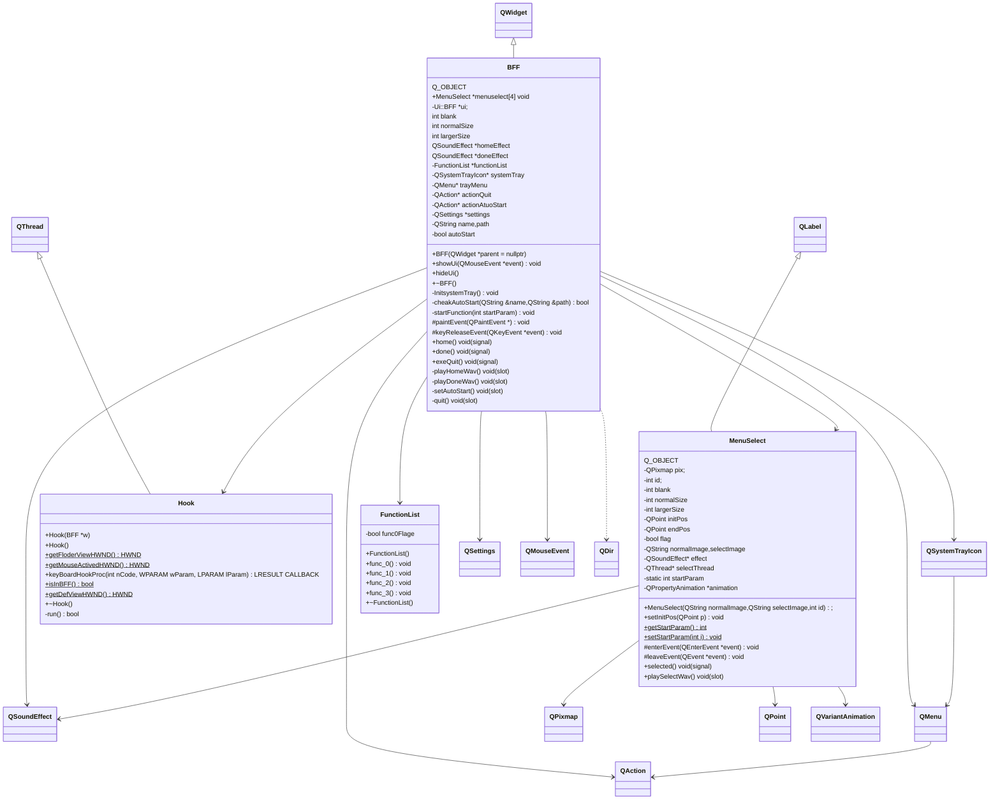

# 桌面辅助GUI

打包的exe 在 release里

 ## 目的

隐藏和显示桌面的图标和任务栏，从而达到能完美观赏桌面背景的效果（Wallpaper Engine的动态桌面确实好看）。

Q：那为什么会有GUI呢？明明使用WIN32API就能实现的事情。

A：就像为了醋包了一顿饺子一样，因为这样更帅 /doge

## 如何使用

在处于桌面时，摁下 ~ 键 即可 弹出 选择菜单。

将鼠标移至某个角 松开 ~ 键 后 即能触发此角对于的功能（注：想不到塞什么功能，仅仅在右下角塞了最初的目的：隐藏和显示桌面图标和任务栏）

在托管栏中可以选择退出和开机自启动

## 如何实现

### 一、需要什么

Qt：gui框架

win32api：微软的api

### 二、如何实现监视键盘和鼠标的操作

#### a.键盘

1.钩子

因为对象是桌面，并不属于Qt的一部分，所以考虑使用win32api中的钩子监控，由钩子监控~键的摁下，从而达到切换到Qt窗口的目的。(能在桌面显示菜单其实做了一些小聪明的事情，菜单的主窗口其实是一个全屏的透明的无边框的窗口，从而达到好像是菜单直接显示在桌面一样)

钩子也分全局钩子和局部钩子

实际测试下来，使用DLL注入或者远程注入到explorer.exe中(桌面进程)中的效果不如直接使用微软的全局底层钩子有效

2.如何找寻需要的进程id和线程id以及句柄

使用spy++

#### b.鼠标

鼠标一系列的操作其实是在Qt窗口做，重载了很多Event，以及信号与槽

###  三、Qt中处理

Qt的类看代码吧 不想补了

具体实现看代码吧，懒得写了

## 题外话

其实写完相当于写了一个gui， 最初的目的只是一角的功能，整体作为快捷触发功能的菜单，以后想写其他的功能塞在一个角中便是。

由于C++是编译型语言，我想不到如何模仿油猴一样，给一个外部接口直接能加载自定义功能

