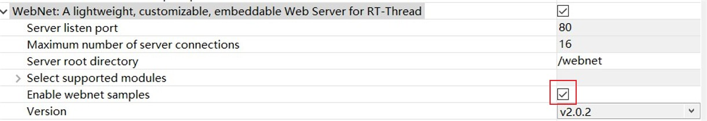

# WebServer


## 一、配置问题

主要参考链接：

https://blog.csdn.net/m0_37845735/article/details/109300175#1%E3%80%81%E6%96%87%E4%BB%B6%E7%B3%BB%E7%BB%9F%E7%9B%B8%E5%85%B3%E7%BB%84%E4%BB%B6%E4%B8%8E%E8%BD%AF%E4%BB%B6%E5%8C%85

这是一个很好的范例文档，相对于webnet自身的文档，环境配置会详细许多

不需要使用ENV进行配置，使用RT-THREAD STUDIO一样能够完成

下面说明使用RT-THREAD STUDIO的配置过程：

### 配置过程

按截图来设置，截图的配置已测试能通过


#### a.文件系统

三层配置图:


##### 1.组件：

- DFS： 
- 
   

   需使能FatFs

- FatFs:

   

**注意：对于我这块W25Q128，设置的处理的最大扇区大小应设置为4096**

- SFUD


开启后不做需改,开启后的同时会开启SPI的配置，也不勾选其他什么选项

##### 2.软件包

- Fal

  

**需打开 FAL使用SFUD驱动程序选择**

##### 3.硬件

- On board


- On chip


#### b.网络

五层配置图


##### 1.组件

- SAL:


开启后不做改动

- netdev：


开启后不做修改

- IWIP

  

  

  **1.关闭DHCP（因为这次使用交叉接线，不需要动态分配）**

  **2.设置静态ipv4，配置随意**

  **3.设置两个栈的大小（至少为1408，因为是WebNet包的最小要求）**
  
  **4.IWIP版本一定一定要设置成v2.0.3或v2.1.2！！！**

##### 2. 软件包

- webnet



**先打开范例测试一下**

- netutils 


**开启tftp服务器使能**

**不知道是不是bug，我这里出来了两个关于tftp服务器使能的选项**


##### 3.硬件

- 打开网卡


**注：POSIX和LIBC是在配置过程中自动开启的**


#### c.挂载文件系统

理论上开启了组件包的自动初始化应该就行，为什么ls没有目录（即开启例程却报错找不到路径）

参考链接：

1.思路：https://club.rt-thread.org/ask/question/10119.html

2.找到的做法：https://club.rt-thread.org/ask/question/10119.html


原因：因为没有挂载文件系统

做法：在main函数中添加

```c
if( dfs_mount("W25Q128", "/", "elm", 0, 0) == 0)
{
rt_kprintf("spi flash mount to /spi !\n");
}
else
{
rt_kprintf("spi flash mount to /spi failed !\n");
}
```

然后finsh输入``mkfs -t elm W25Q128``格式化


如果开机后看到**spi flash mount to /spi !**说明成功挂载

成功后应该看到的代码


之后finsh使用``list_device``命令


Block Device的ref count值为1而不是零能说明成功挂载

使用``ls``命令能出现目录一样也能证明成功

#### d.代码问题

例程中会有一个未定义的变量errno，修改log语句或者定义errno变量都可

#### e.上传文件

范例成功的启动需要上传他自带的三个文件:index.html、index.shtml、version.asp

##### 创建webnet文件夹

finsh命令使用``mkdir webnet``在根目录创建文件夹webnet

##### 使用tftp协议上传

finsh命令使用``tftp -s``开启tftp服务器

在客户端使用tftpd64上传（安装包我打包放在了``/tools``里，需先安装）


三个上传完可以验证一下

若使用``cd webnet`` 、``ls``后出现这样的记为上传成功


**正常情况下，第一次应该会上传不成功，卡在第一个分组的传输上**

**这是因为虽然建立了连接，但是防火墙墙了tftpd64的传输**

**所以，一定要将tftp64允许通过公共和专用的网络！！！！！！**


##### 启动webnet的sample例程

finsh命令输入``webnet_test``

此时，访问服务器能出现例程samples的index网页


到此，例程的配置成功

例程的代码打包放在了``/sample_success/f4_sample_success_copy.7z``

文件还是得自己上传


## 二、代码

