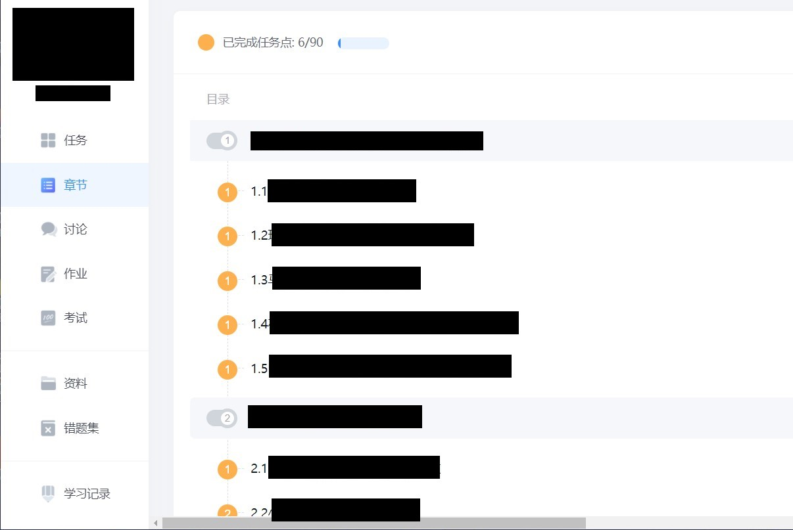

# 这是一个学习通刷课的简易脚本

因为github没法上传大于25M的内容，所以这个版本只有源码，打包成exe的我会放在release

**仅供学习交流使用，请于24小时内删除**

核心功能的实现参考：https://zhuanlan.zhihu.com/p/442902586

在此基础上更改了一些

* 增加了应对弹窗事件的能力

- 增加了处理视频播放中弹出测试的功能

- 采用网页静音代替播放框架静音

- 采用直链主界面的方式代替多窗口的切换方式

- 修复未做题的整体算作为未完成的逻辑

- 采用子线程的方式避免阻塞主线程

- 增加了简易GUI

  

## 文件说明

一个包含整个工程的源码的文件夹和一个可执行文件

注：

Final.py是gui文件

MyThread是执行主要功能的线程文件

AllToOne.py是将前两者合在一个文件并做了路径读取修改 方便打包

## 安装依赖

必须安装项：Chrome游览器及其驱动（没有自己游览器的版本的驱动，则安装离自己游览器最近的版本的驱动

安装教程：https://www.cnblogs.com/lfri/p/10542797.html（selenium不用装，已经打包好了

## 使用方式

1.运行可执行文件

2.在托盘栏右键后选择开始

3.在窗口中填入账号密码和课程url 勾选相应配置

4.点击启动即可开始运行

**注：不考虑 账号 密码 url的健壮性，请正确输入**

**另: 没有病毒 没有病毒 没有病毒 不放心的看源码**

**鼠标悬浮于托盘栏图标可显示当前进度**

注：

课程url指的是这种页面的url

有视频后习题指的是这种

## 开源

此脚本是以作者课程为基础制作的脚本，可能碰到其他情况导致脚本抛出异常或者闪退等

例如，课程默认为只有视频，或者只有视频和**一个**视频后习题，其他情况均不能识别

又或者是章节视频中穿插ppt观看（没有实例，没有制作此功能

如何解决？

**请勿联系作者，开源的目的，是让有能力者阅读源码后添加新功能或者解决bug（注释偷懒了写的不是很多**

**作者写这个的目的，只是为了更好的开摆，而不是抽空改bug**

可以做的更好

- 使用数据库储存课程直链
- 使用随机函数模拟等待
- 通过更改请求头模拟手机或者电脑，双线程同时刷两门课

- 接入题库完成答题

## 杂谈

- 另一种思路是配合代理获取响应，便不用跳入跳出框架，在某校的量化评价教脚本中使用过此思路
- 不用爬虫而是自动化的原因是觉得剖析学习通的网络协议太麻烦，但是相对的，自动化的性能开销远大于爬虫
- 没写数据库是觉得一次课后台挂到结束便不用了